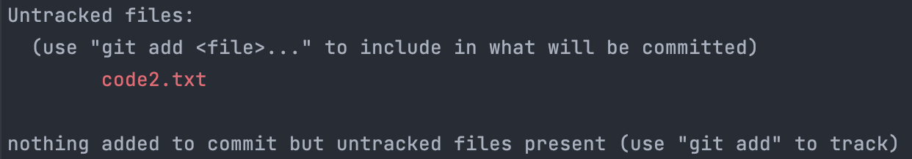

##  Git 사용법 기초

### `git init`

처음 `Git`을 사용할 때 필요한 명령어 입니다. <br>
프로젝트를 진행하려는 디렉토리에 최초 한 번만 입력해주면 됩니다.

#### 계정 정보 입력
```
git config --global user.email <myEmail>
git config --global user.name <myName>
```

### `git status`

`Git`으로 관리되고 있는 파일의 상태를 확인할 수 있습니다.

### git 상태 종류

* **modified** : 파일을 수정하면 그 파일은 `modified` 상태가 됩니다.<br>

* **staged** : 변경된 파일을 `git add` 명령어를 통해 `stage area`로 올리면 `staged` 상태가 됩니다.<br>

* **committed** : `staged` 파일을 `git commit -m <message>`를 통해 해당 파일을 `committed` 상태로 바꿀 수 있습니다.

* **untracked files** : 아직 `Git`이 관리하지 않는 파일입니다. 보안에 위협이 되는 파일은 `git`으로 관리하지 않는 것을 권장합니다.

    

    `git init` 명령어 실행 후 새로운 파일을 추가하면 `untracked file`이 추가됩니다.

### `git add`
```
git add <fileName>
```

* `modified` 상태의 파일을 `staged` 상태로 변경합니다.

* 해당 파일을 `stage`에 올립니다. (`staged 상태`)

* `git add .` 명령어를 통해 `stage`에 올라가지 않은 모든 파일을 `stage`에 올릴 수 있습니다.

### `git restore`
```
git restore --staged <fileName>
```
* `staged` 상태의 파일을 `modified` 상태로 변경합니다.

* 모든 파일을 초기화 하려면 `git restore --staged .` 명령어 사용합니다.

### `git commit`
```md
git commit -m "Commit Message"
git commit <file><file2><file3> -m "Commit Message"
git commit -am "Commit Message"
```
* 보편적으로 사용하는 `git commit` 명령어입니다.
* 여러 파일을 선택적으로 커밋하고 싶을 때 사용
* `git add`와 `git commit`명령어를 한번에 사용 가능합니다.

### `git log`
```md
git log
git shortlog
git log --oneline
git show <commitId>
```
* 커밋의 id, 시간, 커밋 메세지가 포함된 목록을 볼 수 있습니다.
* shortlog를 통해 간략한 정보를 확인 가능합니다.
* `--oneline`을 추가하면 `shortlog`보다 더 많은 정보를 포함해 확인이 가능합니다. <br>
* 특정 `<commitId>`를 이용해 수정 내용을 확인할 수 있습니다.

### `git diff`
```md
git diff <fileName>
```
* 모든 코드의 수정 내용을 알고 싶을 때 사용합니다.

&rarr; `Git` 입장에서는 코드가 수정되면 기존 작성된 코드가 삭제되고 새로 작성된 코드가 추가되는 개념입니다. 

### `git remote`
```md
git remote add <name> <url>
ex) git remote add origin https://github.com/viaunixue/nero.blog
```
지역 저장소에서 작업한 코드를 `Git`에 저장하고 `Github`에 올려 원격 저장소를 연결해야 합니다. 
* `name`이라는 이름으로 `url`을 연결합니다.

### `git push`
```md
git push <name> <branch>
ex) git push origin main
```
* `git remote`를 하고나면 기본적으로 `main`라는 브랜치가 생성됨
* 지역 저장소의 `main` 브랜치 버전 내역을 원격 저장소의 `main` 브랜치에 반영합니다.

### `git pull`
```md
git pull <remote> <branch>
ex) git pull origin master
```
* 협업 시 충돌을 막기 위해 작업 전에 `git pull` 명령어로 시작합니다.

### `git reset`
```java
git reset HEAD~1            // committed -> modified
git reset --mixed HEAD~1
git reset --soft HEAD~1     // committed -> staged
git reset --hard <commitId> // committed -> 기존 상태
git reset --hard HEAD~1
```
* 커밋을 초기화 하고 싶을 때 사용합니다.
* `HEAD`는 현재 커밋의 위치를 나타냅니다. `HEAD~1`은 현재 커밋 위치에서 한 개의 커밋 내용을 뒤로 돌리는 의미를 가집니다.
* 커밋 이후 해당 명령어를 사용하게 되면 파일들을 `modified` 상태로 변경됩니다. 
* `--soft` 옵션은 파일들이 `staged` 상태로 변경됩니다. 
* `--hard` 옵션은 `<commitId>` 이후 작성한 모든 커밋 내용을 삭제합니다.
* `--hard` 옵션으로 `HEAD~1`에 가면 `committed` 상태를 수정 이전 혹은 생성 이전 상태로 변경합니다.
* `git reset HEAD~1` &rarr; `git restore <fileName>`과정과 동일한 기능을 가집니다.
<br><br>


> 이미 `github`에 올라간 내용을 되돌리기 위해서는 어떻게 해야 할까요?

`git reset` 명령어는 커밋 자체가 사라지기 때문에 되돌리려는 내용을 다른 작업자가 알 수 없습니다. <br>
그래서 되돌리는 내용도 표시할 수 있도록 `git revert` 명령어를 사용합니다.

### `git revert`
```md
git revert HEAD
git revert <commitId>
```
* 되돌리려고 하는 커밋을 그대로 유지하고, 새로운 커밋을 통해 되돌리는 기능
* 보통 협업할 때 `revert` 명령어를 주로 사용합니다.
* 되돌리려고 하는 내용을 공유하기 위해서 사용합니다.

### `git branch`
```java
git branch <branch>     // 브랜치 생성
git branch -d <branch>  // 브랜치 삭제
git checkout <branch>   // 브랜치 이동
```
> 브랜치를 나눠서 사용하는 이유?

신기능을 개발하다 보면 운영 이슈 혹은 버그가 발생할 때, 브랜치를 나누지 않았을 경우 개발하던 신기능을 모두 되돌려야 합니다. 

하지만 브랜치를 나누어 사용하게 되면 운영에 사용하는 브랜치를 `master`에 두고, 신기능을 개발하는 브랜치를 따로 생성해 작업하게 되면 운영 이슈가 발생했을 때 브랜치 이동을 통해 서로의 코드를 간섭받지 않게 됩니다.

운영 이슈를 `master` 브랜치에서 해결하고 다시 본인의 브랜치에서 신기능 개발을 이어갈 수 있습니다.

그렇기 때문에 항상 `git branch` 명령어로 현재 브랜치 위치를 확인하는 습관을 들이는게 좋습니다.

추가적으로 `git pull origin <branch>` 명령어를 이용해 다른 작업자들과 작업한 내용을 동기화 하고 진행하는게 좋습니다.

### `git merge`
```md
git merge <branch>
```
* 현재 브랜치에서 다른 브랜치의 변경 내역을 가져옵니다.

> 만약 `develop` 브랜치에서 `main` 브랜치의 변경 내역을 가져오고 싶다면, <br>
`git checkout develop` &rarr; `git merge master` 순서로 명령어를 입력하면 됩니다. <br>
만약 `merge` 과정을 포기하고 싶다면 `git merge --abort` 명령어를 입력하면 됩니다.

### `git rebase`
```md
git rebase <branch>
```
* 현재 브랜치에 다른 브랜치의 변경 내역을 가져오면서 `base`를 재설정 합니다.

`git merge`의 경우 현재 브랜치에 다른 브랜치의 변경 내역을 가져오면서 새로운 커밋이 발생하게 되는데, <br>
`git rebase`의 경우 현재 브랜치와 다른 브랜치의 변경 내역을 시간 순서대로 반영하고, 새로운 커밋이 발생하지 않습니다. <br>

#### 하지만 많은 작업자들이 사용하는 브랜치의 경우 `rebase` 명령어를 사용하는 것은 위험합니다.

기존 작업자들의 커밋 히스토리가 변경되는 경우, 각 작업자들은 때에 따라 자신의 커밋을 다시 반영하거나 재작업을 해야할 수 있습니다.

`git rebase` 진행 중 `conflict`가 발생하는 경우, `git rebase --continue` 명령어를 입력하면 됩니다. <br>
`git rebase` 과정을 포기하고 싶다면 `git rebase --abort` 명령어를 입력하면 됩니다.

> `git merge`, `git pull`, `git rebase` 명령어 사용 중 `conflict`가 발생한다면? <br>

**다른 작업자와 같은 코드를 수정하게 되서 나타나는 "충돌" 입니다.** <br>
이러한 경우 우선적으로 해당 코드 내용을 수정합니다. <br>
수정하지 않고 파일 추가, 커밋, 푸시하게 되면 `conflict`가 발생한 부분은 각 브랜치에서 들어온 내용을 `모두` 반영하게 됩니다.

수정이 완료 되었다면 해당 파일을 `add` &rarr; `commit` &rarr; `push` 합니다.
```md
git commit -am <commitMessage>
git push origin <branch>
```

### `git cherry-pick`
```java
git cherry-pick <commitId>              // 1개 커밋을 적용
git cherry-pick <commitId> <commitId>   // 1개 이상 커밋을 적용
git cherry-pick <commitId>..<commitId>  // 범위 이용해서 커밋을 적용
```
* 앞에 입력한 `commitId` 부터 뒤에 입력한 `commitId` 이전의 모든 커밋을 적용합니다.
* 다른 브랜치의 변경 내역을 가져오고 싶은 경우 대부분 `rebase`, `merge` 명령어를 사용합니다.
* 특정 변경 내역을 가져오고 싶을 때 `cherry-pick` 명령어를 사용합니다.

### `git stash`
```java
git stash           // 임시 저장소 생성
git stash list      // 임시 저장소 목록
git stash apply     // 임시 저장소 반영
git stash drop      // 임시 저장소 삭제
git stash pop       // 임시 저장소 반영 & 삭제
```
* 어느 브랜치에서 수정 작업을 진행하던 중 다른 브랜치로 이동하고 싶을 때 사용합니다.
* 보통 작업을 진행하던 중 다른 브랜치로 이동하게 되면 에러가 발생합니다.
* 임시 저장소를 생성하여 해당 작업 내용을 저장한 뒤 브랜치를 이동합니다.
* `git stash list`에서 최근에 추가된 내용이 0번으로 추가됩니다.
* `git stash drop` 명령어는 저장 내용은 반영하지만, 임시 저장소에 해당 내용이 삭제되지 않습니다.
* `git stash pop`은 저장 내용 반영과 저장소 삭제를 동시에 진행합니다.

<br>

> git stash 명령어가 유용하게 사용되는 경우는 브랜치를 착각했을 때입니다.

만약 `develop` 브랜치에서 작업해야 하는 기능을 브랜치를 확인하지 않고 `master` 브랜치에서 작업했을 때 <br>
작업 내용이 별로 없다면 수정 사항을 `git restore` 하면 됩니다.

하지만 작업 내용이 많다면 다른 방법을 찾아야 합니다.
```md
git stash
git checkout develop
git stash pop
```
이러한 경우 다음 명령어를 입력하게 되면 모든 수정 사항이 `develop` 브랜치로 이동하게 됩니다.

`git stash pop` 명령어를 사용했을 때 `conflict`가 발생하게 될 수 있지만, 동일하게 수정하고 반영하면 됩니다.