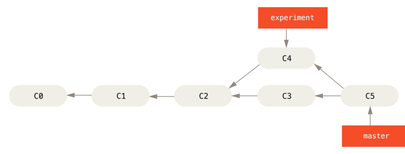
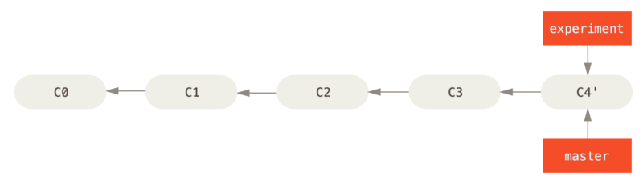

## Rebase 사용법


위 예제는 `C2`에서 두 개의 브랜치로 나뉘어 작업을 진행하고 있는 모습입니다.<br>

### `Merge`

먼저, 일반적으로 두 브랜치를 병합하는 방법으로 다음과 같이 `merge` 하는 방법을 사용합니다.<br>
두 브랜치의 마지막 커밋 2개 (`C3`, `C4`)와 공통 조상 `C2`를 사용하는 `3-way Merge`로 새로운 커밋 `C5`를 만들어냅니다.




### `Rebase`

위 예제를 `rebase` 명령으로 병합한다면 다음과 같습니다.
```
$ git checkout experiment
$ git rebase master
First, rewinding head to replay your work on top of it...
Applying: added staged command
```


`Rebase`할 브랜치(`experimanet`)가 합칠 브랜치(`master`)가 가리키는 커밋을 가리키게 합니다. <br>
이는 `C3`에서 변경된 사항을 `Patch`로 만들고, 이를 다시 `C4`에 적용시키는 방법이 있습니다.

> 실제로 일어나는 일을 설명하자면 일단 두 브랜치가 나뉘기 전인 공통 커밋으로 이동하고 나서 <br> 그 커밋부터 지금 Checkout 한 브랜치가 가리키는 커밋까지 Diff 를 차례로 만들어 어딘가에 임시로 저장해 놓습니다. 



```
$ git checkout master
$ git merge experiment
```

`C4'`로 표시된 커밋에서의 내용은 `Merge` 예제에서 살펴본 `C5` 커밋 내용과 동일할 것입니다. <br>

`Merge`보다 `Rebase`가 좀 더 깨끗한 히스토리를 만드는 것을 확인할 수 있습니다. <br>
일을 병렬로 동시에 진행해도 `Rebase`를 하고 나면 모든 작업이 선형으로 차례대로 수행된 것처럼 보이게 됩니다.

## Rebase 활용법

`Rebase` 명령어는 단순히 브랜치를 합치는 것 말고 다른 용도로도 사용이 가능합니다.


다음은 `master` 브랜치에서 `server` 브랜치를 만들고 `server` 브랜치에 `client` 브랜치를 만들어 2개의 브랜치가 추가된 모습입니다. 

이때 테스트가 덜 된 `server` 브랜치는 그대로 두고 `client` 브랜치만 `master`로 합치려고 합니다. <br>
`server`와 관련 없는 `C8`, `C9` 커밋을 `master` 브랜치에 적용하기 위해 `--onto` 옵션으로 사용하여 아래와 같은 명령을 실행합니다.
```
$ git rebase --onto master server client
```
이 명령은 `master` 브랜치부터 `server` 브랜치와 `client` 브랜치의 공통 조상까지의 커밋을 `client` 브랜치에서 없애고 싶을 때 사용합니다.
<br>


`client` 브랜치에서만 변경된 패치를 만들어 `master` 브랜치에서 `client` 브랜치를 기반으로 새로 만들어 적용합니다.<br>
이제 `master` 브랜치로 돌아가서 "Fast-Forward" 시킬 수 있습니다. 


```
$ git checkout master
$ git merge client
```

`server` 브랜치 작업이 모두 끝나면 `git rebase <base_branch> <topic_branch>` 명령으로 checkout 없이 바로 <br>
`server` 브랜치를 `master` 브랜치로 Rebase 할 수 있습니다.


```
$ git rebase master server
```
이 명령을 `server` 브랜치를 checkout 하고 `master` 브랜치에 Rebase 합니다.

이제 마지막으로 `master` 브랜치를 "Fast-forward" 시키면 됩니다.


```
$ git checkout master
$ git merge server
$ git branch -d client
$ git branch -d server
```

## Rebase 위험성

Rebase는 기존의 커밋을 그대로 사용하는 것이 아니라 내용은 같지만 다른 커밋을 새로 만듭니다.

#### 따라서 다른 동료가 작업 중인 외부에 공개 된 저장소 브랜치를 대상으로 Rebase 하면 안됩니다. <br> 왜냐하면 rebase 할 경우 다시 merge 해야 하는데 merge 한 내용을 pull 하면 코드가 엉망이 되기 때문입니다.

## Rebase 충돌 시 해결법

부드럽게 `merge` 된다면 좋겠지만 충돌이 생기면 개발자가 `conflict`를 해결하고나 **rebase를** 취소할 수 있도록 해야 합니다.

**rebase**를 실패하면 `git status` 명령어로 `conflict`가 생긴 파일들의 목록을 확인합니다.

1. `rebase`를 완전히 취소하려면 `--abort` 옵션을 이용합니다.
    ```
    $ git rebase --abort
    ```

2. `conflict`를 수정하고 계속하고 싶다면 수정 후 `--continue` 옵션으로 계속 진행을 시도합니다.
    ```
    $ git add -u
    $ git rebase --continue
    ```
    `rebase`는 내 브랜치의 커밋 하나하나를 따로 `merge` 합니다.
    따라서 이 과정을 반복할 수도 있으니 천천히 수정해 나가면 됩니다.

3. `conflict`가 내 브랜치 변경 사항을 무시해도 되거나, 내 브랜치 변경사항이 맞다고 확신할 경우 다음의 명령을 진행합니다.
    ```
    # 내 브랜치 변경점을 우선으로 적용
    $ git checkout --theirs <파일_풀_경로>

    # master 변경점을 우선으로 적용
    $ git checkout --ours <파일_풀_경로>
    ```
    `theirs` : **`내 브랜치`** 변경점을 수락하며 자동으로 `conflict` 해결

    `ours` : **`master`** 브랜치 변경점을 수락하며 자동으로 `conflict` 해결 

4. 처음부터 어느쪽 변경사항을 적용하는 것이 맞는지 확실히 아는 경우 `rebase` 명령어 사용 시 `theirs`와 `ours`를 지정할 수 있습니다.
    ```
    # 내 브랜치 변경점을 우선으로 하여 자동으로 Resolve 하면서 Rebase 진행
    $ git rebase --strategy-option theirs master
    $ git rebase -X theirs master # 짧은 버전
    ```