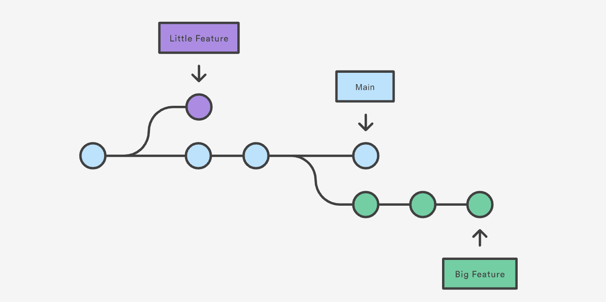

## Git 이란 무엇인가?

쉽게 말해, `Git`은 마법 상자로 비유할 수 있습니다.  
우리가 작업한 내용을 기록해 두고, 필요할 때마다 그 기록을 다시 보거나 되돌릴 수 있게 도와줍니다.  
예를 들어, 우리가 그림을 그린다고 상상할 때, 그림이 마음에 들지 않는다면 `Git`은 마법처럼 이전의 좋았던 그림으로 돌아가게 해줍니다.

`Git`의 특징은 아래와 같습니다.

1. 대표적인 분산형 버전 관리 시스템. 원격 저장소와 별개로 개발자 각각의 로컬 컴퓨터에 완벽한 복제본 소스 코드를 저장할 수 있다.
2. 네트워크나 인터넷이 연결되어 있지 않아도 로컬 컴퓨터에서 버전을 관리 할 수 있다.
3. 원격 저장소로 많은 개발자의 저장소와 연결하거나 동기화 작업을 할 수 있다.

`Git`을 사용하는 가장 큰 이유는 **버전 관리**와 **협업**입니다.
`Git`은 지역 저장소에서 버전 관리가 수행됩니다.  
그렇기 때문에 원격 저장소나 네트워크에 문제가 있어도 작업이 가능합니다.

## Github 란 무엇인가?

`Github`는 다양한 그림들을 보관하는 큰 미술 갤러리로 생각할 수 있습니다.  
예를 들어, 모두가 자신의 그림을 올리면, 그것들이 모여 큰 미술 전시회를 만들 수 있습니다.

즉, `Github`는 `Git` 저장소 호스팅을 지원하는 웹 서비스입니다. 

`Git`을 사용하는 프로젝트를 지원하는 웹 호스팅 서버이기 때문에, `Git`을 사용하는 모든 프로젝트를 `Github`에서 관리할 수 있습니다.