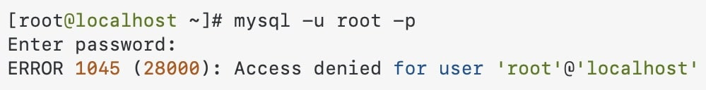
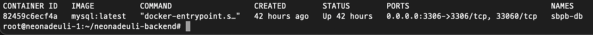
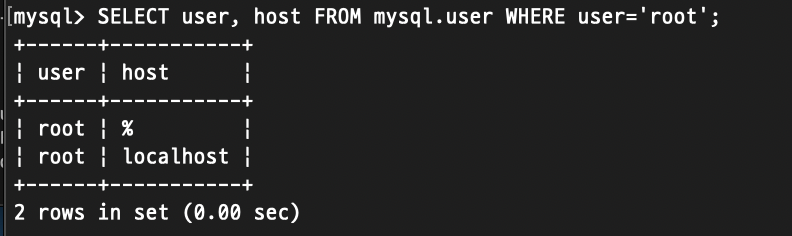

## 들어가며

운영 서버에 Docker로 MySQL을 안전하게 구축하는 법을 공유해보려합니다 👀

이 글에서는 제가 실제 프로덕션 환경에서 겪은 경험을 바탕으로, <br>
안전하고 효율적인 Docker MySQL 구축 방법을 단계별로 살펴보겠습니다.

## 🧑🏻‍💻 Docker MySQL 구축 기본 원칙

프로덕션 환경에서 DB를 가장 안전하게 사용하는 방법은 AWS를 사용하신다면 `RDS`를 사용하는 게 가장 안전하고 빠를 것입니다. 하지만 RDS는 비용이 발생하고 대신 Docker 를 통해 DB를 띄워서 사용하신다면 다음의 원칙들을 준수하는 것이 좋습니다.

1. 최소 권한 원칙 (Principle of Least Privilege)
2. 설정의 단계적 적용
3. 볼륨 관리를 통한 데이터 영속성 보장
4. 보안 설정의 명확한 문서화

## 🤔 처음부터 꼬인 설정의 늪

서버에서 Docker로 MySQL을 세팅하면서 가장 많이 본 화면이 있습니다.<br>



구글링을 해보아도 위 접근 권한을 해결하기 위한 수많은 포스팅 글이 존재합니다. 오늘은 제가 이 에러 화면과 이별하기까지의 여정을 공유하려고 합니다. 더 이상 이 에러로 고통받지 않도록, 제가 쉽게 세팅하고 안전하게 사용할 수 있도록 그 해결 과정을 정리해보았습니다.

## 🔌 기본 환경 구성

<div style="color: black; background-color: #e6f3ff; border: 1px solid #b3d9ff; padding: 15px; margin: 20px 0; border-radius: 5px;">
  <strong>💡 최소한의 설정으로 시작하기 </strong> <br>
</div>

```yaml
version: '3.8'

services:
  mysql:
    container_name: production-db
    image: mysql:latest
    restart: unless-stopped
    environment:
      MYSQL_ROOT_PASSWORD: 1234
      MYSQL_DATABASE: db-name
      TZ: Asia/Seoul
      character-set-server: 'utf8mb4'
      collation-server: 'utf8mb4_unicode_ci'
    ports:
      - '3306:3306'
    volumes:
      - ./mysql/data:/var/lib/mysql
      - ./mysql/conf.d:/etc/mysql/conf.d
    command:
        - "mysqld"
        - "--character-set-server=utf8mb4"
        - "--collation-server=utf8mb4_unicode_ci"

```

  가장 기본적인 세팅으로 다음은 제가 최종적으로 도달한 기본 docker-compose.yml 설정입니다. <br> 이렇게 최소한의 접속이 보장되도록 먼저 설정하는게 좋습니다.


## 🔨 단계별로 하나씩 해결하기

### 1. 도커 컨테이너 실행하기

```bash
# Docker 컨테이너 올리기
docker-compose up --build -d

# Docker 컨테이너 확인
docker ps
```

여기서 팁 하나! -d 옵션을 꼭 붙이세요.
이 옵션이 있어야 Docker가 백그라운드에서 실행됩니다.

### 2. MySQL 접속 확인하기



위 이미지처럼 도커가 잘 작동한다면 해당 MYSQL가 잘 동작한다는 의미입니다! <br>
이제 접속만 잘 되기를 기도하면 됩니다.

```bash
# 서버 내부에서 Docker로 띄운 DB 접속하기
docker exec -it sbpb-db mysql -u root -p
```

<div style="color: black; background-color: #d4edda; border: 1px solid #c3e6cb; padding: 15px; margin: 20px 0; border-radius: 5px;">
    <strong>⚠️ 여기서 잠깐! </strong> <br> 이렇게 기본 설정만 하고 방치하면 프로덕션 환경에서는 DB 해킹을 당합니다. <br>
</div>

### 3. DB 보안 강화하기

먼저 root 계정이 어떤 호스트에서 접근 가능한지 확인해봅시다!

아래 명령어로 '%'가 아닌 다른 호스트에 대한 root 계정 사용 유무를 확인해주어야 합니다.


```sql
SELECT user, host FROM mysql.user WHERE user='root';
```



위 명령어에서 확인한 모든 Host의 root 계정 암호를 다음 명령어로 변경해주고 재시작 해줍니다.

```sql
# 모든 root 비밀번호 변경
ALTER USER 'root'@'localhost' IDENTIFIED BY '새로운_복잡한_비밀번호';
ALTER USER 'root'@'%' IDENTIFIED BY '새로운_복잡한_비밀번호';
FLUSH PRIVILEGES;
```

```bash
# Docker 재시작
docker-compose down -v
docker-compose up -d
```

## 🌟 외부 접속 설정

매번 서버에 접속하여 DB에 접속하기 싫다면 외부에서 접속할 수 있도록 다음 세팅을 해주어야 합니다.

매번 서버에 접속해서 DB를 들여다보는 건 너무 불편하죠.<br>
외부에서도 안전하게 접속할 수 있도록 새로운 사용자를 만들어봅시다.

저는 'sbpb' 이라는 유저를 등록해주었습니다. <br>
제가 사용할 유저이기 때문에 모든 호스트 접속 설정까지 해두었습니다.

```sql
# 새로운 사용자에게 localhost에서의 접속 권한 부여
CREATE USER 'sbpb'@'localhost' IDENTIFIED BY '새로운 복잡한 비밀번호';
GRANT ALL PRIVILEGES ON geultto.* TO 'sbpb'@'localhost';
FLUSH PRIVILEGES;

# 새로운 사용자에게 필요한 권한만 부여
CREATE USER 'sbpb'@'%' IDENTIFIED BY '새로운_복잡한_비밀번호';
GRANT ALL PRIVILEGES ON geultto.* TO 'sbpb'@'%';
FLUSH PRIVILEGES;
```

이제 로컬 환경에서 새로운 터미널을 열고 다음의 접속 명령어를 작성해줍니다!

```bash
mysql -h 서버_IP주소 -P MYSQL_포트번호 -u MYSQL_유저 -p MYSQL_비밀번호 MYSQLDB_이름
```

## 🔒 보안을 위한 주요 파일 권한 세팅

해킹 이후 배운 교훈 중 하나는 파일 권한의 중요성입니다.

다음과 같이 중요 파일들의 권한을 제한해두세요!

```bash
# docker-compose.yml 파일과 .env 파일은 소유자만 읽고 쓸 수 있도록 설정
chmod 600 docker-compose.yml
chmod 600 .env

# mysql 디렉토리 및 내부 파일 권한 설정
chmod -R 600 mysql
chmod -R root:root mysql
```

## 💪 귀찮은 건 자동화하자

매번 로컬에서 서버 DB에 긴 접속 명령어를 입력하기 너무 귀찮습니다.

저는 다음과 같은 쉘 스크립트를 만들어서 사용하고 있습니다 👾

```bash
#!/bin/bash

# 변수 정의하기
SERVER_IP="IP 주소"
MYSQL_PORT="포트번호"
MYSQL_USER="유저이름"
MYSQL_PASSWORD="복잡한 비밀번호"
MYSQL_DATABASE="DB 이름"

# MySQL database 연결하기
mysql -h $SERVER_IP -P $MYSQL_PORT -u $MYSQL_USER -p$MYSQL_PASSWORD $MYSQL_DATABASE
```

위 코드로 쉘 파일을 만들었다면 다음 권한 부여도 잊지 말아야 합니다.

```bash
chmod +x {쉘파일명}.sh
```

위 설정을 해두면 이제 아래 명령어로 쉽게 접속이 가능합니다!
```bash
./{쉘파일이름}.sh
```

## 🪜 Docker DB 초기화

그럼에도 설정 과정에서 문제가 발생한다면.. 

리셋이 필요한 경우 다음 명령어를 사용하면 좋습니다.

```bash
# Docker 컨테이너 볼륨 제거
docker-compose down -v
 
# Docker 컨테이너 기존 볼륨 확인
docker volume ls
 
# 모든 볼륨 확인 및 제거
docker volume rm <volume_name>
 
# 사용하지 않는 모든 볼륨 제거
docker volume prune -f
```

그리고 docker-compose.yml 에서 만들어진 파일을 제거하고 다음 명령어로 새롭게 생성합니다!
```bash
# 기본 mysql 데이터 디렉토리 제거
rm -rf /mysql
 
# Docker 컨테이너 새롭게 생성
docker-compose up --build --force-recreate -d
```
## 🤔 Docker로 프로덕션 DB를?

사실 이 질문에 대한 답은 "경우에 따라 다르다" 입니다. <br>
제 경험을 바탕으로 장단점을 공유해드리겠습니다.

### 장점

* 빠른 구축과 재현: 개발/스테이징/운영 환경을 동일하게 구성하기 쉽습니다
* 자원 효율성: 여러 DB를 하나의 서버에서 운영할 때 자원 관리가 용이합니다
* 백업/복구 자동화: Docker 볼륨을 활용한 백업/복구가 편리합니다

### 단점

* 성능 오버헤드: 컨테이너 레이어로 인한 약간의 I/O 성능 저하가 있습니다
* 모니터링 복잡성: 호스트와 컨테이너 양쪽을 모두 모니터링해야 합니다
* 운영 복잡도: 볼륨 관리, 네트워크 설정 등 추가적인 관리 포인트가 생깁니다

### 권장 사용 사례

* 중소규모 서비스의 프로덕션 DB
* MSA 환경에서의 서비스별 독립 DB
* 개발/테스트 환경의 DB

### 비권장 사용 사례

* 대규모 트래픽의 메인 DB
* 금융/의료 도메인의 데이터 관리
* 극도의 I/O 성능이 필요한 경우

## 📦 데이터는 영구적으로, 컨테이너는 일회용으로

프로덕션 환경에서 Docker로 DB를 운영하면 다음과 같은 고민이 생깁니다.

* 컨테이너를 재시작했더니 데이터가 모두 사라졌다..
* 새 버전으로 컨테이너를 교체하려는데 기존 데이터를 어떻게 옮겨야 할지 모르겠다ㅜ
* 데이터 백업을 어떻게 해야 할지 막막하다....

이런 문제들은 모두 데이터를 컨테이너 내부에 저장했기 때문에 발생합니다. <br>
이를 해결하기 위한 개념이 바로 `stateless 컨테이너` 입니다.

### 1. Stateless 컨테이너란?

Docker 컨테이너를 자동차의 엔진이라고 생각하면 쉽게 이해할 수 있습니다.<br>
여기서 저장되는 `데이터는 연료 탱크의 기름`이라고 할 수 있는데, `엔진(컨테이너)`이 고장나서 교체하더라도 `연료 탱크(볼륨)`의 `기름(데이터)`는 그대로 유지됩니다!

```plaintext
[이전 방식]
컨테이너 = 애플리케이션 + 데이터
컨테이너가 삭제되면 데이터도 함께 사라짐 😱

[Stateless 방식]
컨테이너 = 애플리케이션
볼륨 = 데이터
컨테이너가 삭제되어도 데이터는 안전하게 보관 😊
```

### 2. 도커 볼륨 시작하기

도커 볼륨 사용은 다음 3단계만 기억하면 됩니다.

1. 볼륨 생성하기
    ```bash
    # 볼륨의 이름은 알아보기 쉽게 지어주세요
    docker volume create my-mysql-data
    ```
2. 볼륨 확인하기
    ```bash
    # 생성된 볼륨 목록 보기
    docker volume ls

    # 볼륨의 상세 정보 보기
    docker volume inspect my-mysql-data
    ```
3. 볼륨 연결하기
    ```bash
    # docker-compose.yml
    services:
      mysql:
        # ... 다른 설정들 ...
        volumes:
          - my-mysql-data:/var/lib/mysql  # 이렇게만 해주면 끝!

    volumes:
      my-mysql-data:    # 사용할 볼륨 이름
        external: true  # 이미 만들어진 볼륨을 사용하겠다는 설정
    ```

### 3. 볼륨 사용의 장점

1. 데이터 영속성
    * 컨테이너를 삭제해도 데이터는 안전
    * 새 버전의 MySQL로 업그레이드해도 데이터 유지

2. 쉬운 백업
    ```bash
    # 볼륨 데이터를 tar 파일로 백업
    docker run --rm \
      -v my-mysql-data:/source \
      -v $(pwd):/backup \
      alpine tar czf /backup/mysql-backup.tar.gz -C /source .
    ```
3. 성능 최적화
    * 호스트의 파일 시스템을 직접 사용하므로 I/O 성능이 좋음
    * 컨테이너 레이어를 거치지 않아 오버헤드 감소

### 4. 실전 볼륨 활용 꿀팁

1. 명확한 볼륨 명명 규칙

    ```
    [서비스명]-[용도]-[환경]
    예: myapp-mysql-data-prod
    ```

2. 다중 볼륨 활용

    ```yaml
    volumes:
      - mysql-data:/var/lib/mysql        # 데이터 파일
      - mysql-conf:/etc/mysql/conf.d     # 설정 파일
      - mysql-logs:/var/log/mysql        # 로그 파일
    ```

3. 볼륨 건강 체크

    ```bash
    # 볼륨 사용량 확인
    docker system df -v

    # 사용하지 않는 볼륨 정리
    docker volume prune
    ```

### 5. 볼륨 주의 사항

1. 볼륨 삭제는 신중하게!
    * `docker volume rm` 명령은 되돌릴 수 없습니다.
    * 프로덕션 환경에서는 항상 백업 먼저하기!

2. 권한 설정 확인
    
    ```bash
    # 볼륨 마운트 지점의 권한 확인
    ls -la $(docker volume inspect my-mysql-data --format '{{ .Mountpoint }}')
    ```

3. 정기적인 볼륨 관리

    ```bash
    # 일주일에 한 번 실행할 관리 스크립트 예시
    #!/bin/bash

    # 사용하지 않는 볼륨 정리
    docker volume prune -f

    # 볼륨 사용량 체크
    docker system df -v | grep "mysql"

    # 오래된 백업 정리
    find /backup -name "mysql-*.tar.gz" -mtime +30 -delete
    ```

## 🎓 볼륨 관리 실습 시나리오

백문이 불여일견이죠.

아래의 직접 볼륨 데이터 보존 테스트 코드로 볼륨 동작 방식을 체험해봅시다. 

  ```bash
  # 1. 볼륨 생성
  docker volume create test-mysql-data

  # 2. MySQL 컨테이너 실행
  docker run -d \
    --name mysql-test \
    -v test-mysql-data:/var/lib/mysql \
    -e MYSQL_ROOT_PASSWORD=test123 \
    mysql:8.0

  # 3. 데이터 입력
  docker exec -it mysql-test mysql -uroot -ptest123 -e \
    "CREATE DATABASE testdb; USE testdb; CREATE TABLE users (name VARCHAR(20));"

  # 4. 컨테이너 삭제
  docker rm -f mysql-test

  # 5. 새 컨테이너로 데이터 확인
  docker run -d \
    --name mysql-test-2 \
    -v test-mysql-data:/var/lib/mysql \
    -e MYSQL_ROOT_PASSWORD=test123 \
    mysql:8.0

  # 6. 데이터가 그대로 있는지 확인
  docker exec -it mysql-test-2 mysql -uroot -ptest123 -e \
    "USE testdb; SHOW TABLES;"
  ```

## 💡 실무 도커 활용 꿀팁

### 1. 모니터링 설정

```bash
# Docker stats에 MySQL 메트릭 추가
docker run -d \
  --name mysql-exporter \
  -p 9104:9104 \
  prom/mysqld-exporter
```
프로메테우스와 그라파나를 연동하면 컨테이너화된 MySQL의 상태를 실시간으로 모니터링할 수 있습니다.

### 2. 자동 페일오버 구성

```yaml
deploy:
  replicas: 2
  restart_policy:
    condition: on-failure
  update_config:
    parallelism: 1
    delay: 10s
```

Docker Swarm이나 Kubernetes를 사용중이라면, <br>
MySQL 복제 구성과 함께 자동 페일오버를 구현할 수 있습니다:

### 3. 성능 최적화

- 볼륨 마운트 시 `delegated` 옵션 사용으로 I/O 성능 향상
- 컨테이너 네트워크 모드를 `host`로 설정하여 네트워크 오버헤드 감소
- `innodb_flush_method`를 `O_DIRECT`로 설정하여 호스트 캐시 중복 방지

### 4. 운영 환경 백업 전략

<div style="color: black; background-color: #f8d7da; border: 1px solid #f5c6cb; padding: 15px; margin: 20px 0; border-radius: 5px;">
    <strong>💥 단순 볼륨 백업을 넘어선 실전 백업 전략</strong> 
</div>

```bash
# 백업 스크립트 예시
#!/bin/bash
TIMESTAMP=$(date +%Y%m%d_%H%M%S)
BACKUP_DIR="/backup/mysql"

# 트랜잭션 정합성을 보장하는 백업
docker exec mysql mysqldump \
  --single-transaction \
  --quick \
  --master-data=2 \
  -u root -p"${MYSQL_ROOT_PASSWORD}" \
  --all-databases > "${BACKUP_DIR}/backup_${TIMESTAMP}.sql"

# 압축 및 원격 저장소 전송
gzip "${BACKUP_DIR}/backup_${TIMESTAMP}.sql"
aws s3 cp "${BACKUP_DIR}/backup_${TIMESTAMP}.sql.gz" \
  "s3://my-backup-bucket/mysql/"
```

### 5. 장애 대비 체크리스트

 1. 볼륨 마운트 경로의 디스크 여유 공간 모니터링
 2. 컨테이너 로그 로테이션 설정
 3. Docker 데몬 장애 시 자동 복구 방안
 4. 네트워크 타임아웃 설정 최적화
 5. 컨테이너 리소스 제한 설정 (CPU, 메모리)

## 🎯 결론

Docker로 MySQL을 운영하는 것은 양날의 검입니다.<br>
편리함과 유연성을 얻을 수 있지만, 그만큼 추가적인 관리 포인트가 생깁니다.

중요한 것은 자신의 서비스 특성과 운영 환경을 고려한 현명한 선택입니다.

처음 설정할 때는 이 글에서 공유한 기본적인 설정으로 시작하시고, <br>
점진적으로 모니터링, 백업, 장애 대응 등을 강화해 나가시는 것을 추천드립니다.

이렇게 해서 제 Docker MySQL 도입기를 마무리합니다.🤤 <br>
처음에는 단순해 보였던 작업이 이것저것 신경 쓸 게 많았네요.

여러분도 제가 겪은 시행착오를 피해서, 안전하고 편리한 Docker MySQL 환경을 구축하시길 바랍니다!

혹시 비슷한 경험이 있으시다면 댓글로 공유해주세요. 다른 개발자분들의 경험담도 궁금합니다. 😊